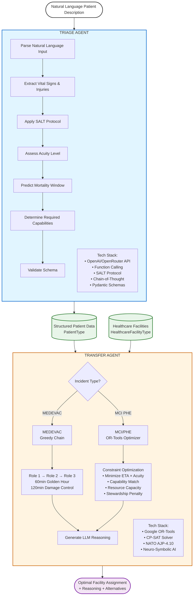

# Disaster Agent

AI-powered disaster management system for patient triage and transfer optimization using neuro-symbolic reasoning.

## Overview

This system implements a complete workflow for disaster response:



### System Dataflow


### Workflow

1. **Natural Language Input**: Describe a patient in plain English (injuries, vital signs, location)
2. **Triage Agent**: Uses SALT protocol with chain-of-thought reasoning to assess patient acuity
3. **Transfer Agent**: Assigns patient to optimal healthcare facility using constraint optimization

### Tech Stack

- **Pydantic**: Type-safe data schemas and validation
- **OpenAI/OpenRouter**: LLM-powered triage with structured output (function calling)
- **OR-Tools**: Google's constraint optimization solver for facility assignment
- **SALT Protocol**: Sort, Assess, Lifesaving Interventions, Treatment/Transport
- **NATO AJP-4.10**: Medical evacuation doctrine (MEDEVAC chains)
- **Neuro-Symbolic AI**: Combines neural reasoning (LLM) with symbolic optimization (constraints)

## Quick Start

```bash
# Install dependencies
pip install pydantic openai ortools

# Run complete workflow
python main.py
```

## Agents

### Triage Agent (`agents/triage/`)

Converts natural language patient descriptions into structured triage assessments using SALT protocol.

**Input**: Natural language description
**Output**: Structured PatientType with acuity, vital signs, required capabilities

**Features**:
- Chain-of-thought reasoning with `<thinking>` tags
- SALT protocol compliance (Immediate, Delayed, Minimal, Expectant, Dead)
- Mortality prediction based on vital signs and injuries
- Structured output via OpenAI function calling

### Transfer Agent (`agents/transfer/`)

Assigns triaged patients to optimal healthcare facilities using constraint-based optimization.

**Input**: PatientType + List of HealthcareFacilityType
**Output**: Transfer decision with destination facility or evacuation chain

**Features**:
- OR-Tools SCIP solver for single-destination optimization (MCI/PHE)
- NATO MEDEVAC evacuation chains (Role 1 → Role 2 → Role 3)
- Configurable optimization rules (`rules.py`)
- Resource stewardship (preserve scarce capabilities)
- Timeline compliance (Golden Hour, Damage Control)
- LLM-generated reasoning for explainable decision-making

## Schemas

- **PatientType**: Patient information including vital signs, injuries, and status
- **HealthcareFacilityType**: Healthcare facility with resources, capabilities, and location
- **Enums**: All enumeration types used across schemas
- **Types**: Reusable common types like LocationType

## Usage

```python
from schemas import PatientType, HealthcareFacilityType

# Create a patient instance
patient = PatientType(**patient_data)

# Create a facility instance
facility = HealthcareFacilityType(**facility_data)
```

## Example Data

### Patient Example

```json
{
  "patient_id": "P-001",
  "name": "John Doe",
  "age": 45,
  "gender": "Male",
  "vital_signs": {
    "heart_rate": 110,
    "blood_pressure": {
      "systolic": 90,
      "diastolic": 60
    },
    "respiratory_rate": 22,
    "oxygen_saturation": 92,
    "temperature": 36.8
  },
  "consciousness": {
    "eye_response": 4,
    "verbal_response": 5,
    "motor_response": 6,
    "total_score": 15
  },
  "acuity": "Severe",
  "injuries": [
    {
      "locations": ["Chest", "Abdomen"],
      "mechanisms": ["Blunt", "Penetrating"],
      "severity": "Severe",
      "description": "Multiple rib fractures with suspected internal bleeding"
    }
  ],
  "required_medical_capabilities": {
    "trauma_center": true,
    "neurosurgical": false,
    "orthopedic": true,
    "ophthalmology": false,
    "burn": false,
    "pediatric": false,
    "obstetric": false,
    "cardiac": true,
    "thoracic": true,
    "vascular": true,
    "ent": false,
    "hepatobiliary": false
  },
  "required_medical_resources": {
    "ward": 1,
    "ordinary_icu": 1,
    "operating_room": 1,
    "ventilator": 1,
    "prbc_unit": 4,
    "isolation": 0,
    "decontamination_unit": 0,
    "ct_scanner": 1,
    "oxygen_cylinder": 2,
    "interventional_radiology": 0
  },
  "description": "45-year-old male involved in motor vehicle collision, presenting with chest and abdominal trauma",
  "predicted_death_timestamp": 1708185600,
  "status": "Unassigned",
  "assigned_facility": null,
  "action_logs": [
    "Patient triaged at scene - 14:30",
    "Vital signs assessed - 14:35"
  ],
  "deceased": false,
  "location": {
    "latitude": 43.6532,
    "longitude": -79.3832
  }
}
```

### Healthcare Facility Example

```json
{
  "facility_id": "F-001",
  "name": "Toronto General Hospital",
  "level": 1,
  "medical_resources": {
    "ward": 50,
    "ordinary_icu": 20,
    "operating_room": 8,
    "ventilator": 25,
    "prbc_unit": 100,
    "isolation": 10,
    "decontamination_unit": 2,
    "ct_scanner": 3,
    "oxygen_cylinder": 50,
    "interventional_radiology": 2
  },
  "capabilities": {
    "trauma_center": true,
    "neurosurgical": true,
    "orthopedic": true,
    "ophthalmology": true,
    "burn": true,
    "pediatric": true,
    "obstetric": true,
    "cardiac": true,
    "thoracic": true,
    "vascular": true,
    "ent": true,
    "hepatobiliary": true
  },
  "vehicle_resources": {
    "ambulances": 12,
    "helicopters": 2
  },
  "location": {
    "latitude": 43.6591,
    "longitude": -79.3877
  },
  "accepted_patients": ["P-003", "P-007", "P-012"]
}
```

## Enums

### Patient Severity
- `Deceased` 
- `Minor`
- `Severe`
- `Critical`
- `Undefined`

### Patient Status
- `Unassigned`
- `Awaiting Transfer`
- `In-Transfer`
- `Arrived`

### Healthcare Facility Level
- `1` - Level 1 Trauma Center (highest capability)
- `2` - Level 2 Trauma Center
- `3` - Level 3 Trauma Center

### Gender
- `Male`
- `Female`
- `Unknown`

### Injury Mechanisms
- `Blunt`
- `Penetrating`
- `Thermal`
- `Blast`
- `Drowning`
- `Chemical`
- `Radiation`
- `Electrical`
- `Hypothermia`
- `Other`

### Injury Locations
- `Head`
- `Neck`
- `Chest`
- `Back`
- `Pelvis`
- `Abdomen`
- `Limbs (Upper)`
- `Limbs (Lower)`
